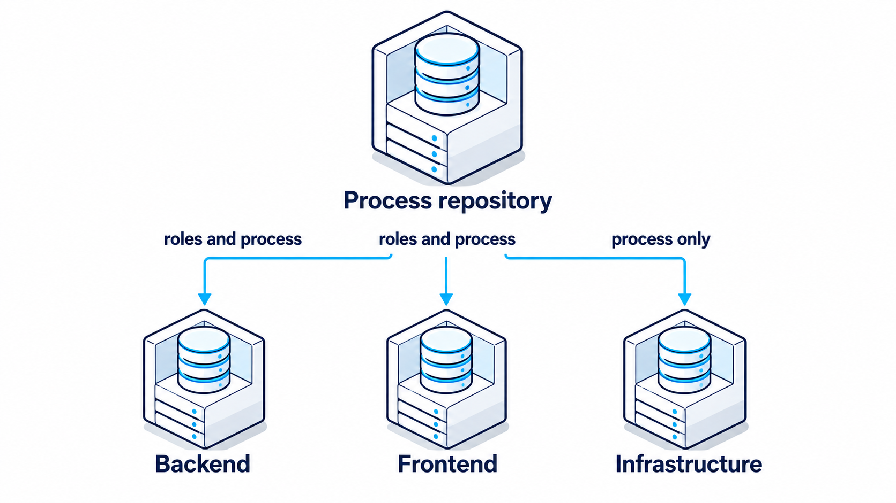
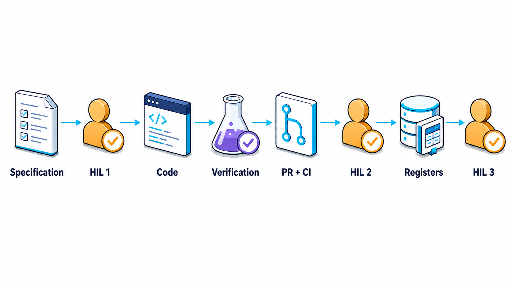
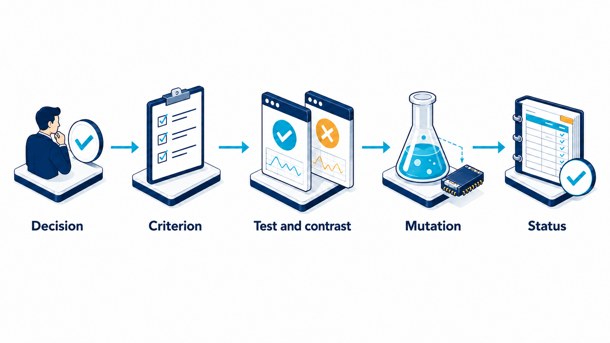

<h1 align="center">
  <picture>
    <source media="(prefers-color-scheme: dark)" srcset="docs/images/ninefold-logo-v1-on-white.png">
    
  </picture>
</h1>

<em>A starter kit for an AI-agent SDLC process.</em>

**Why "Ninefold":** the process is carried by nine actors — eight specialized agent roles
(Product Owner, Analyst, Architect, Developer, QA, Invariant Guardian, Reviewer, Security
Auditor) plus the human — and that number is not incidental. It's the structural core the whole
kit is built around: a role that produces something never evaluates it, and every handoff between
roles puts a fresh set of eyes on the result (see `FrameworkDoc.md`, section 3).

An anonymized, portable excerpt from a real SDLC process based on Spec-Driven Development
and Human-in-the-Loop, described in [`FrameworkDoc.md`](FrameworkDoc.md). This directory contains
**working artifacts**, not just a description: agent role definitions, Issue/PR templates, a label
manifest, sync scripts, a pre-push hook, and a guide to reconstructing the whole thing on a new
repository.

All project names, organization, business domain, and specific identifiers (ADR numbers, Issue,
PR, hosts, accounts) have been removed or replaced with placeholders in angle brackets,
e.g. `<repo-backend>`, `<owner>`, `<Entity>`. Substitute the specifics of your own project for them.

## Start here

Pick the row that matches what you came to do:

| You want to… | Start with | Then |
|---|---|---|
| **Understand the process** | [`FrameworkDoc.md`](FrameworkDoc.md) §1–5 and the three diagrams below | [`process/sdlc-flow.md`](process/sdlc-flow.md) (states and gates), one role as a sample — [`agents/invariant-guardian.md`](agents/invariant-guardian.md) |
| **Install it on your repositories** | [`process/bootstrap-guide.md`](process/bootstrap-guide.md) — the installation guide, steps 0–13, each with a check | [`TEAM-CONTRACT-TEMPLATE.md`](TEAM-CONTRACT-TEMPLATE.md), [`process/registers/`](process/registers/README.md) |
| **Upgrade an existing installation** | [`UPGRADING.md`](UPGRADING.md) | the release notes of the version you move to |
| **Drive a task** (after installing) | `/task-status #N` first — read-only — then `/task #N`: [`process/task-status-command.md`](process/task-status-command.md), [`process/task-command.md`](process/task-command.md) | [`process/sdlc-flow.md`](process/sdlc-flow.md) |
| **Decide whether to trust a role's report** | [`calibration/README.md`](calibration/README.md) | [`process/invariant-assertions.md`](process/invariant-assertions.md) — what to move from a role into CI |
| **Change this kit** | the tool self-tests (`node tools/<tool>.mjs --self-test`, `bash process/scripts/boundary-check.sh --self-test`) | [`.github/workflows/kit-ci.yml`](.github/workflows/kit-ci.yml) — the same checks on every pull request |

**Short on time:** `FrameworkDoc.md` §1–5, `process/sdlc-flow.md`, and `process/bootstrap-guide.md`
steps 0–6 (a working installation); steps 9–10 (calibration, one pilot task) before the first real
task. [`CASE-STUDY.md`](CASE-STUDY.md) — the measured numbers from the source project — can be
skipped entirely.

### What you need before installing

Two repositories: your own copy of this kit (the **process repository**) and the **product
repository** it serves. On the machine: `git`, Node.js 22+, the GitHub CLI `gh` (authenticated), an
agent environment that loads roles from a directory (e.g. Claude Code), and administrator rights on
the product repository. Details and a check for each: `process/bootstrap-guide.md`, step 0.

### Read this before you rely on it

- **Placeholders are not optional.** Everything in `<angle brackets>` is yours to fill in; the sync
  scripts refuse to run while one is left.
- **The checklists are examples.** The Guardian's rules, the developer checklists and the
  invariants in the PR template must be rewritten for your domain — carrying them over unchanged is
  theater, not control (`FrameworkDoc.md`, §12).
- **Three decisions stay human** — scope (gate 1), merge (gate 2), status (gate 3). Agents never
  merge; a code PR says `Refs #N`, so the Issue stays open until the gate-3 documentation PR.
- **Calibrate before you trust.** An evaluating role's `PASS` means something only after it was run
  on material with a known answer — and the result holds for one definition, one model and one way
  of invoking it. Roles run on the model of the session that calls them.
- **Know what your protection really is.** On a private repository on GitHub's free plan there is no
  server-side branch protection — the pre-push hook is a guard, not a gate. On a paid plan, enforce
  the rules for administrators too: the agents act on your account.

## The process at a glance

**Where the process lives.** One process repository is the source of truth; product repositories
inherit roles and process from it, the infrastructure repository only the process
(`FrameworkDoc.md`, sections 3 and 11).

**How one task moves.** Agents work between the stops; the three human approvals (HIL 1–3) —
scope, merge, and the status raised in the registers — are never skipped (`FrameworkDoc.md`,
sections 4 and 5).

**What counts as proof.** A status is raised only at the end of the chain, and an empty link
anywhere zeroes out the rest (`FrameworkDoc.md`, section 6).

## How to read this directory

1. **[`FrameworkDoc.md`](FrameworkDoc.md)** — the philosophy and mechanics of the process: nine
   roles, three human gates, mutation testing as the core of proof, state management, parallel
   work by multiple agents, how role cost is measured. Start here to understand **why** the rest of
   the directory looks the way it looks.
   *Optional:* **[`CASE-STUDY.md`](CASE-STUDY.md)** — the measured numbers and worked examples
   from the source project (token cost per role, two tasks traced from ticket to merge, documented
   tool failures). Not needed to adopt the process; read it to see what the pattern cost in practice.
2. **[`TEAM-CONTRACT-TEMPLATE.md`](TEAM-CONTRACT-TEMPLATE.md)** — the team contract: who does what,
   which tools they don't have, where the boundary lies that can't be expressed in the permission
   declaration itself, how to launch a role. This is the document the role definitions defer to in
   case of discrepancy.
3. **[`agents/`](agents/)** — eight role templates to adapt (Product Owner, Analyst, Architect,
   Developer, QA, Invariant Guardian, Reviewer, Security Auditor). The evaluating roles
   (`invariant-guardian.md`, `reviewer.md`, `security-auditor.md`) have checklists marked as
   EXAMPLE — write your own, concrete rules. `developer.md` combines the backend/frontend variants
   in a single file with two example checklists side by side; if you have two technology stacks,
   split it into two files (see the note at the top of the file).
4. **[`process/`](process/)** — the state machine, label manifest, Issue and PR templates, the
   pre-push hook, minimal register templates (`process/registers/`), the `main` protection
   variant without a paid plan, repository settings, release versioning, the cross-repository gap
   channel.
   **[`task-command.md`](process/task-command.md)** and
   **[`task-status-command.md`](process/task-status-command.md)** — the full content of the
   command that drives one task through the whole lifecycle (the equivalent of
   `/zadanie_be`/`/zadanie_fe`) and its read-only sibling (`/zadanie_stan`) — they belong in the
   product repository, not here (see `FrameworkDoc.md`, section 4).
5. **[`tools/`](tools/)** — `sync-agents.mjs` (copies role definitions from the process repository
   to the `.claude/agents/` of the product repository) and `sync-github.mjs` (distributes Issue/PR
   templates and prints `gh` commands for labels). Both carry a `--self-test` of built-in contrast
   cases (calibration Method 3) that also runs silently before every real run; this repository's
   own CI (`.github/workflows/kit-ci.yml`) runs the self-tests, the label manifest check and
   `check-links.mjs` (relative Markdown links) on every pull request.
6. **[`calibration/`](calibration/)** — how to check that an evaluating role actually evaluates,
   before you start trusting it.
7. **[`process/bootstrap-guide.md`](process/bootstrap-guide.md)** — a step-by-step sequence of
   actions to go from an empty repository to a working pipeline with gates. Start here if you want
   to **act**, not just understand.

**Already installed an earlier version?** [`UPGRADING.md`](UPGRADING.md) takes a process repository
and its product repositories forward one version at a time (v0.1.0 → v0.2.0 → v0.3.0 → v0.4.0).

## What this kit deliberately does not contain

- **Specific domain checklists.** The Guardian's rules, the Analyst's criteria, the invariants in
  the PR template — all of this has to be written from scratch for your domain and your stack.
  FrameworkDoc.md §12 states this explicitly: *roles and gates are universal, checklists are not*.
- **CI configuration for a specific runner provider.** `process/ci-and-branch-protection.md` and
  `process/repository-settings.md` describe patterns (path filter versus required check, runner
  watchdog, `runs-on` as an expression) — not ready-made workflow files.
- **A persistent orchestrator.** FrameworkDoc.md §3 describes the entry condition under which it's
  even worth building one. This kit assumes you haven't reached it yet.

## License

Licensed under the [Apache License, Version 2.0](LICENSE) — free to use, modify and distribute,
commercially or not. Keep the [`LICENSE`](LICENSE) and [`NOTICE`](NOTICE) files with any copy or
derivative, and mark the files you changed.

Copyright 2026 Mariusz Miziołek.
