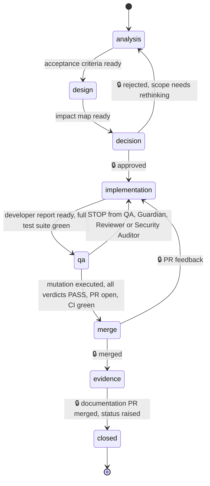

# SDLC flow and state machine

> Template for adaptation. Scope: one product repository (`<repo-backend>` or
> `<repo-frontend>`). Stories and pull requests live in the product repository, where the work is
> owned — its gates and evidence stay under one team's review. (GitHub's `Closes owner/repo#12`
> would close an Issue in another repository on merge; keeping tasks with their code is a choice,
> not a platform limit.) The process source repository is the source of truth for the label
> manifest and templates, not a place of work.

## States

Exactly **one** `state:*` label per Issue. The `role:*` label says who is holding the ball.



🔒 = a transition that only a human performs.

| State | Who works | Exit from this state |
|---|---|---|
| `state:analysis` | Product Owner, Analyst | *Definition of Done* and *Out of scope* filled in |
| `state:design` | Architect | Impact map; on deviation — ADR deviation label |
| `state:decision` 🔒 | **You** — gate 1 | Scope and architecture approved |
| `state:implementation` | Developer | Developer report ready, full test suite green — no PR yet |
| `state:qa` | QA, Invariant Guardian, Reviewer, Security Auditor (conditional) | Contrast test and mutation recorded, every verdict `PASS` on the same checkpointed version (`VERIFIED`); then PR with the full template, CI green |
| `state:merge` 🔒 | **You** — gate 2 | PR merged |
| `state:evidence` 🔒 | **You** — gate 3 | Documentation PR with the entries prepared by the agent, merged; it says `Closes #<N>` |
| `state:closed` | — | Status raised in the register; the Issue is closed |

The PR is opened at the end of `state:qa`, not at the end of implementation: its description
carries the mutation result and the verdicts, so it cannot be complete earlier.

Merging and raising the status are two separate human decisions. A merged PR only moves the Issue
to `state:evidence` — "green tests" and "task complete" are deliberately separate claims.

**The Issue stays open until gate 3.** The code PR refers to it with `Refs #<N>`, never a closing
keyword: GitHub closes an Issue when a PR carrying `Closes`/`Fixes` merges into the default
branch, and a closed Issue drops out of the `is:open` filter below exactly when it is waiting for
you. Only the gate-3 documentation PR says `Closes #<N>`. An Issue closed in any state other than
`state:closed` is flagged by `label-guard`.

## One filter that's enough

```
is:open label:waiting-on-human
```

The `waiting-on-human` label accompanies every gate state. Thanks to it you don't need to
remember which states are gates — one filter shows everything that is standing and waiting for
you. An agent that enters a gate state **applies this label and stops working**.

## Rules we don't break

**An agent does not remove the `waiting-on-human` label.** Removing it is equivalent to making a
decision. You remove it, by moving on to the next state.

**An agent does not pass through a gate on its own**, even when the answer seems obvious. A gate
through which an agent sometimes passes on its own stops being a gate.

**The ADR deviation label stops work regardless of state.** It is removed only by an accepted
decision or by an explicitly recorded deviation with a date and justification.

**The `evidence:missing` label blocks the transition to `state:closed`.** Code that exists but
has no passing test does not check off the task — this is not a formality, it is the only reason
the progress register can be trusted.

**The label invariants are checked by a workflow, not remembered.** Exactly one `state:*` label,
`waiting-on-human` on every gate state, no `state:closed` next to `evidence:missing` — the
[`workflows/label-guard.yml`](workflows/label-guard.yml) template comments on the Issue and goes
red on a violation. It can't tell who removed `waiting-on-human` while agents act on the human's
account; that one stays a rule.

## What this machine does not cover

Process tasks of the AI team itself (e.g. `PROC-1-xx`) **have no Issue**. They live in the
process rollout plan with *Definition of Done* rows, and progress in the run log. For a handful
of such tasks, a separate tracker would be a tool without work to do.
